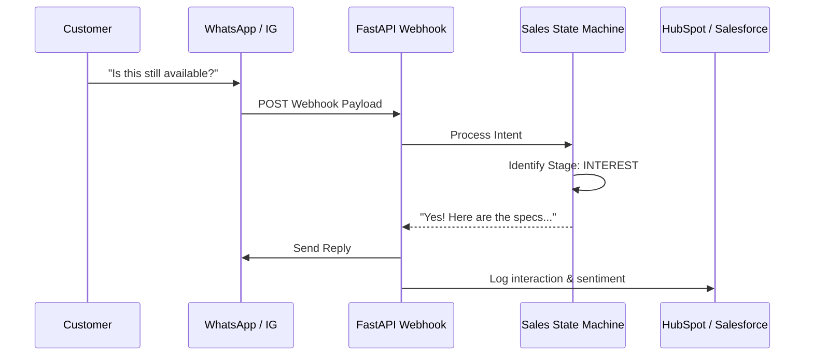

# MetaCloud AI Sales Closer 💬

An omnichannel workflow automation agent that connects to WhatsApp, Instagram, and SMS (via Twilio). It uses a state-machine-driven conversational AI to handle objections, negotiate, and close sales autonomously while syncing data back to HubSpot/Salesforce.

## 🎯 Business Value
- **24/7 Sales Pipeline:** Never miss a lead on social media or WhatsApp.
- **High Conversion Rate:** State-machine logic prevents the LLM from endlessly chatting without driving toward a sale.
- **Single Source of Truth:** Bi-directional CRM syncing ensures the sales team has full visibility.

## 🏗️ System Architecture



## 🛠️ Tech Stack
- **Core:** Python 3.11, FastAPI
- **Integrations:** Twilio, Meta Graph API, HubSpot API
- **Infrastructure:** Docker, Redis (for session state)

## 🚀 Quick Start
```bash
docker-compose up --build
```
