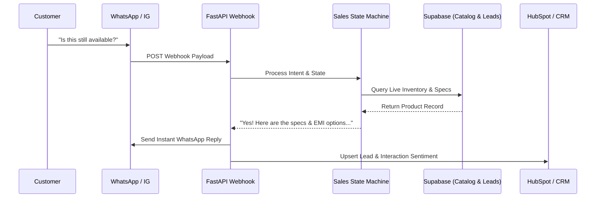

# Omnichannel AI Sales & Inbound Lead Qualifier

A production-ready conversational pipeline connecting Meta (WhatsApp/Instagram) webhooks to Supabase and CRM systems for automated lead qualification and instant customer inquiry handling.

## 🎯 Business Value
- **24/7 Sales Pipeline:** Never miss a lead on social media or WhatsApp.
- **High Conversion Rate:** State-machine logic prevents the LLM from endlessly chatting without driving toward a sale.
- **Accurate Catalog Specs:** Queries Supabase directly to provide verified product specs and pricing with zero hallucinations.
- **Single Source of Truth:** Bi-directional CRM syncing ensures the sales team has full visibility.

## 🏗️ System Architecture



## 🛠️ Tech Stack

- **Core:** Python 3.11, FastAPI

- **Integrations:** Twilio, Meta Graph API, HubSpot API

- **Infrastructure:** Docker, Redis (for session state)


## 🚀 Quick Start

```bash

docker-compose up --build

```


## Connect with Me


- **Portfolio:** [kishjandeepyonghang.me](https://kishjandeepyonghang.me)

- **LinkedIn:** [Kishjan Deep Yonghang](https://www.linkedin.com/in/kishjan-yonghang-b6a324430/)

- **Facebook:** [Kishjan Deep Yonghang](https://www.facebook.com/profile.php?id=61575446859939)

- **WhatsApp:** [+977-9815972075](https://wa.me/9779815972075)

- **Email:** yonghangkishjan608@gmail.com

